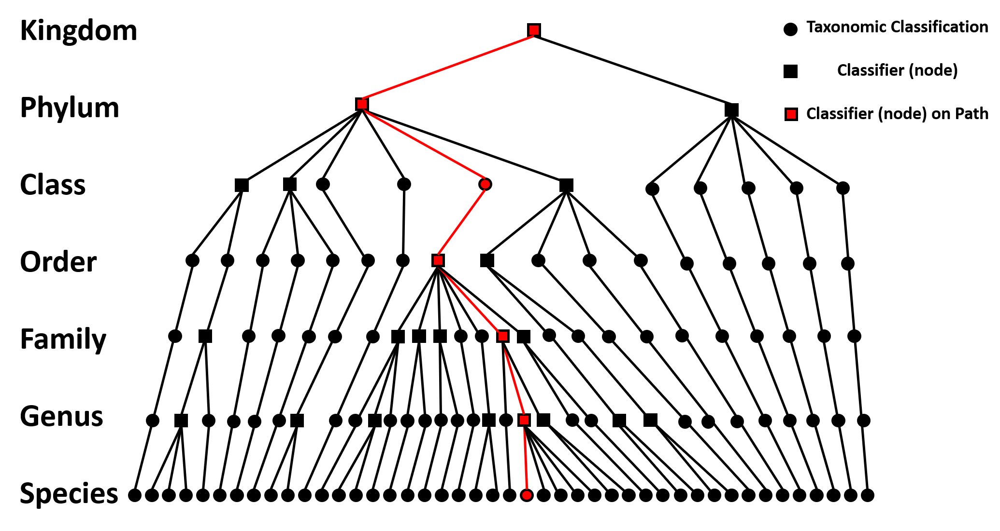

# Linked machine learning classifiers improve species classification of fungi when using error-prone long-reads on extended metabarcodes
___

A proof-of-concept for the use of linked machine learning classifiers for the purpose of detecting key target species from basecalled Oxford Nanopore reads.

We include the code used for the DNA filtering, the training and testing of machine learning models, and the linking of models into a decision tree.

While the specific code is not optimised for end-user use, we demonstrate that the tree-descent approach using linked machine learning models is viable (see [our paper](https://www.biorxiv.org/content/10.1101/2021.05.01.442223v2))

___

### Dependencies

#### For Machine Learning
>Argparse 1.4.0  
Biopython 1.78  
Keras 2.6.0  
Matplotlib 3.4.2  
Numpy 1.19.5  
Pandas 1.1.3  
Python 3.7.3  
Scikit-learn 0.24.2  
Tensorflow 2.6.0  

#### For comparison to other techniques
>Ete3 3.1.1  
Kraken2 2.0.8-beta  
Minimap2 2.17  

___

### Creating a Linked Machine Learning Decision Tree
As a proof-of-concept, we demonstrate the applicability of a linked machine learning decision tree. Here, we lay out the steps necessary to generate your own decision tree for use for fungal species detection.    

1. Obtain DNA sequence of the same DNA barcoding region (eg. the extended ITS region) for a number of different species across the fungal kingdom. This should include the target species and several close relatives from the same family and genus. Filter for higher quality reads to improve the accuracy of training. Ensure you have the full taxonomic information for each species used   
2. Using a cladogram, identify the nodes where two or more taxa diverge. Note all samples that belong to each branch of the node. For each node, randomly subsample an equal number of reads from all taxa belonging to each branch. This should result in the number of subsampled reads for each branch at a node being equal, and representative of the samples belonging to that node, although the number of reads per taxa may vary    
3. Convert the DNA sequence for reads at a node to integer or one-hot encoding and pad each sequence using a null value to ensure all lengths are equivalent    
4. Randomly subsample 85% of the encoded data for use in training the models, and the other 15% for testing the models. Define the labels for each read so that each read has a label identifying the taxa it belongs to (eg. Ascomycota or Basidiomycota when training a model to distinguish between phyla)    
5. Create the machine learning models. As a convolutional neural network applied to one-dimensional (linear) data, this will require multiple one-dimensional convolution layers. Our CNNs were constructed the CNN with seven layers. The first two layers each have 64 convolution (1D) filters, with a kernel size of 3 and ReLU activations. These are followed by a Dropout layer (0.5) and then a 1D Max Pooling layer of size 2. The output is passed into a flatten layer, followed by a Dense layer (100 parameters) before it is finally passed into a Dense layer with a Softmax activation to perform the classification. The networks were trained using the Adam optimiser, with the Categorical cross-entropy loss function. See [the model parameters file](model_parameters.txt). Compile the model and fit the model using several epochs (≥10), using the test dataset set aside in step 4 as the validation dataset. The specific models used in our paper are available [here](https://doi.org/10.5281/zenodo.6585752)    
6. Repeat steps 3-5 for each node in the decision tree to create a machine learning classifier for every node    
7. Link the resultant models together such that a read is passed along the paths in the decision tree based on the output of the machine learning classifiers. For example, if the output of the model that distinguishes between fungal phyla outputs that a read belongs to the Ascomycota phylum, the read is input to the next node along that path (likely the model that distinguishes between classes within the Ascomycota phylum). See below image  
 

 

An example path through the machine learning decision tree, highlighted in red, demonstrating how reads are passed down the tree from the kingdom-level classifier (distinguishes between phyla) to the genus-level classifier (distinguishes between species). Note that not all steps along the path are nodes, which can be remedied by increasing the diversity of taxa chosen for training. 
    

___

### Running a Linked Machine Learning Decision Tree
In order to run the decision tree on basecalled reads, the reads must first be converted to the integer or one-hot encoding used to train the models. Then, the reads are fed into the linked decision tree. Record the outputs, including the raw confidence score outputs and making use of the highest confidence score result as the predicted result. Applying a confidence score threshold for positive identification of a target species may reduce the number of false positive and false negative detections. We recommend making use of threading to increase the rate at which this can be done. Note that our code is intended as a proof-of-concept and is not optimised for computational performance and runtime    

Additonal taxa can be added to this decision tree. This requires retraining all models within the path of tree descent, to a maximum of 6 retrained models (due to the way the decision tree is designed). Dictionaries of taxa would also have to be updated with the new taxa. For example, the addition of the *Candida auris* species would require retraining the Kingdom Fungi, Phylum Ascomycota, Order Saccharomycetales, Faily Saccharomycetaceae and Genus Candida models.  
We are working on optimising the code for end-user use that will include easy ability to add additional taxa. 
